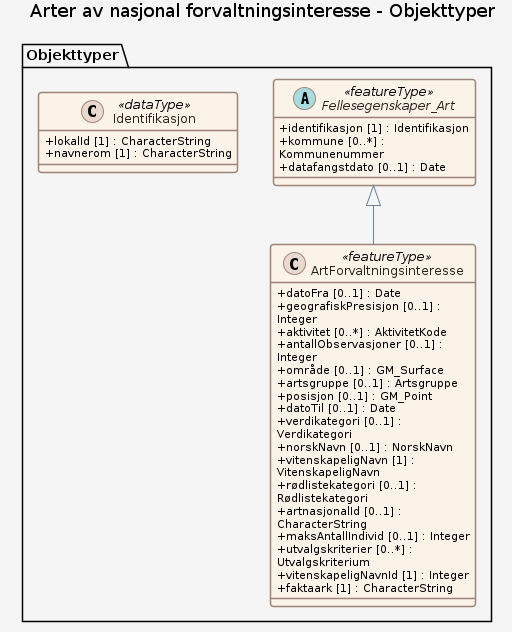

# Produktspesifikasjon: Arter av nasjonal forvaltningsinteresse

*Arter av nasjonal forvaltningsinteresse er et forvaltningsrettet datasett som distribueres av Miljødirektoratet, der datafangsten helt og fullt er basert på dataflyten for artsdata som er etablert av Artsdatabanken. Artsdatabanken har, siden etableringen i 2005, etablert dataflyt med relevante institusjoner og relevante databaser som blir synliggjort i Artskart. Eierskapet til data er avklart og ligger hos originalverten. 

Arter av nasjonal forvaltningsinteresse består både av arter som trenger beskyttelse og arter som er skadelige (fremmede). Alle relevante artsgrupper er omfattet. Beslutning om hvilke arter som inngår er i all hovedsak tatt i henhold til ulike relevante statuser som arter kan befinne seg i. Trua arter, ansvarsarter og freda arter er eksempler på slike statuser, som i datasettet er definert som utvalgskriterier. 

I tillegg til at det er besluttet hvilke arter som skal inngå, er det besluttet to kvalitetsparametere som må være utfylt eller som må fylle noen minstekrav; geografisk presisjon og funksjon (aktivitet). Disse kravene varierer mellom ulike artsgrupper. 

Kartlagte forekomster av sensitive funksjonsområder for gitte arter, dvs. forekomster som det ikke skal være allmenn tilgang til detaljert informasjon om, er ikke inkludert i dette datasettet.*

**Nøkkelord:** Biologisk mangfold, Arter, Norge, Svalbard, Jan Mayen, Artsfordeling, Inspire, geodataloven, Det offentlige kartgrunnlaget, Norge digitalt, ØkologiskGrunnkart, modellbaserteVegprosjekter, fellesDatakatalog, Natur

**Emnekategorier:** Biologisk mangfold

**Geografisk utstrekning**:

- **Vest**: 2.0
- **Øst**: 33.0
- **Sør**: 57.0
- **Nord**: 72.0

**Tidsmessig utstrekning**:

- **Tidsperiode**:
  - **Fra**: 2015-02-16
  - **Til**: 2021-01-01

## Om spesifikasjonen

> **Denne versjonen av produktspesifikasjonen:**  
> **Opprettet dato:** 2015-02-16 
> **Endret dato:** 2021-01-01 
> **Språk:** nor 
> **Kontaktinformasjon:** Miljødirektoratet, [post@miljodir.no](mailto:post@miljodir.no)

## Om produktet Arter av nasjonal forvaltningsinteresse

> **Romlig representasjonstype:** Vektor 
> **Unik identifikator:** <https://data.geonorge.no/sosi/artsmangfold/arter_nasjonal_forvaltning> 
> **Kontaktinformasjon:** Miljødirektoratet, [post@miljodir.no](mailto:post@miljodir.no)
>
> **Romlig oppløsning:**
>
> **Ekvivalent målestokk**: 1000
>
> **Begrensninger:**
>
> **Ressursbegrensninger**:
>
> - **Bruksbegrensninger**: Ingen begrensninger på bruk er oppgitt.
>
> **Juridiske begrensninger**:
>
> - **Tilgangsbegrensninger**: Åpne data
> - **Bruksbegrensninger**: Lisens
> - **Lisens**: Creative Commons BY 4.0 (CC BY 4.0)
> - **Lisenslenke**: <https://creativecommons.org/licenses/by/4.0/>
> - **Andre begrensninger**: Data i datasettet er linsensiert av Artsdatabanken. Miljødirektoratet publiserer data uten endringer, men med tilleggsegenskapene Forvaltningskategori og Utvalgskriterium. Ved bruk av data oppgis Artsdatabanken og Miljødirektoratet som kilde.
>
> **Sikkerhetsbegrensninger**:
>
> - **Klassifisering**: Ugradert

### Formål

Formålet med datasettet er å vise leveområder for arter av nasjonal forvaltningsinteresse, som det bør tas spesielt hensyn til i arealplanlegging, eller som det av andre årsaker er nyttig å ha kunnskap om (overvåking, bekjempelsesprosjekt for fremmede arter).

### Bruksområde

Datasettet gir verdifull informasjon til bruk bl.a. i den kommunale arealplanleggingen og annen planlegging av arealbruk. Samtidig gir datasettet føringer for hvilke arter som bør inngå i artskartlegging.

Datasettet egner seg for fremstilling av temakart, interaktive kart, kartløsninger på internett og til
geografiske analyser.

## Omfang

### Hele datasettet

**Nivå**: dataset

**Nivåbeskrivelse**: Gjelder hele datasettet. Hvis omfang ikke er oppgitt under en overskrift, gjelder teksten for hele datasettet og alle leveranser

## Datainnhold og struktur

### Datamodell

#### ArtForvaltningsinteresse

Forekomster/observasjoner av et kriteriebasert utvalg arter som er spesielt viktig for biologisk mangfold, samt fremmede arter som er en trussel mot naturlig biologisk mangfold. Alt innhold hentes fra Artsdatabankens infrastruktur, basert på arten og nærmere definerte tekniske kvalitetskriterier (geografisk presisjon mv.).

Egenskaper

<table class="feature-attribute-table">
  <colgroup>
    <col style="width: 35%;" />
    <col style="width: 65%;" />
  </colgroup>
  <tbody>
    <tr>
      <th scope="row">Navn:</th>
      <td><strong>datoFra</strong></td>
    </tr>
    <tr>
      <th scope="row">Definisjon:</th>
      <td>Startdato for registreringen</td>
    </tr>
    <tr>
      <th scope="row">Multiplisitet:</th>
      <td>0..1</td>
    </tr>
    <tr>
      <th scope="row">Type:</th>
      <td>DateTime</td>
    </tr>
  </tbody>
</table>

<table class="feature-attribute-table">
  <colgroup>
    <col style="width: 35%;" />
    <col style="width: 65%;" />
  </colgroup>
  <tbody>
    <tr>
      <th scope="row">Navn:</th>
      <td><strong>geografiskPresisjon</strong></td>
    </tr>
    <tr>
      <th scope="row">Definisjon:</th>
      <td>Angis i hele meter og kan representere forskjellige forståelser av geografisk presisjon, avhengig av hvordan originaldata er etablert. Generelt for flater vil gjelde at presisjon er et uttrykk for observatørens oppfatning av hvor nøyaktig objektet er geografisk avgrenset/omsluttet på kart i forhold til de faktiske forhold i terrenget. Dette vil også gjelde punktdata i en rekke tilfeller. For punktdata er presisjonen avstanden (radius) mellom midtpunktkoordinatene for det observerte objektet og yttergrensa for det arealet (sirkelflaten) som punktet representerer.</td>
    </tr>
    <tr>
      <th scope="row">Multiplisitet:</th>
      <td>0..1</td>
    </tr>
    <tr>
      <th scope="row">Type:</th>
      <td>Integer</td>
    </tr>
  </tbody>
</table>

<table class="feature-attribute-table">
  <colgroup>
    <col style="width: 35%;" />
    <col style="width: 65%;" />
  </colgroup>
  <tbody>
    <tr>
      <th scope="row">Navn:</th>
      <td><strong>aktivitet</strong></td>
    </tr>
    <tr>
      <th scope="row">Definisjon:</th>
      <td>angir type aktivitet som er knyttet til observasjonen/forekomsten. Er bare aktuelt for arter som er mobile og kan ha flere ulike aktiviteter, f.eks. fugl.</td>
    </tr>
    <tr>
      <th scope="row">Multiplisitet:</th>
      <td>0..*</td>
    </tr>
    <tr>
      <th scope="row">Type:</th>
      <td>AktivitetKode</td>
    </tr>
    <tr>
      <th scope="row">Tillatte verdier:</th>
      <td>- stasjonær - muligReproduksjon - næringssøkende - reproduksjon - forflytting - død</td>
    </tr>
  </tbody>
</table>

<table class="feature-attribute-table">
  <colgroup>
    <col style="width: 35%;" />
    <col style="width: 65%;" />
  </colgroup>
  <tbody>
    <tr>
      <th scope="row">Navn:</th>
      <td><strong>antallObservasjoner</strong></td>
    </tr>
    <tr>
      <th scope="row">Definisjon:</th>
      <td>Antall observasjoner</td>
    </tr>
    <tr>
      <th scope="row">Multiplisitet:</th>
      <td>0..1</td>
    </tr>
    <tr>
      <th scope="row">Type:</th>
      <td>Integer</td>
    </tr>
  </tbody>
</table>

<table class="feature-attribute-table">
  <colgroup>
    <col style="width: 35%;" />
    <col style="width: 65%;" />
  </colgroup>
  <tbody>
    <tr>
      <th scope="row">Navn:</th>
      <td><strong>område</strong></td>
    </tr>
    <tr>
      <th scope="row">Definisjon:</th>
      <td>objektets utstrekning - artsdata område, for eksempel</td>
    </tr>
    <tr>
      <th scope="row">Multiplisitet:</th>
      <td>0..1</td>
    </tr>
    <tr>
      <th scope="row">Type:</th>
      <td>GM_Surface</td>
    </tr>
  </tbody>
</table>

<table class="feature-attribute-table">
  <colgroup>
    <col style="width: 35%;" />
    <col style="width: 65%;" />
  </colgroup>
  <tbody>
    <tr>
      <th scope="row">Navn:</th>
      <td><strong>artsgruppe</strong></td>
    </tr>
    <tr>
      <th scope="row">Definisjon:</th>
      <td>Angivelse av  hvilken artsgruppe arten tilhører</td>
    </tr>
    <tr>
      <th scope="row">Multiplisitet:</th>
      <td>0..1</td>
    </tr>
    <tr>
      <th scope="row">Type:</th>
      <td>Artsgruppe</td>
    </tr>
    <tr>
      <th scope="row">Tillatte verdier:</th>
      <td>- fugler - karplanter - sopper - insekter - laver - fisker - krepsdyr - moser - pattedyr - øvrigeDyr - alger - edderkoppdyr - amfibierOgReptiler - biller - bløtdyr - koralldyr - mangefotinger - nebbmunner - nettvinger - rettvinger - sekkedyr - sommerfugler - tovinger - vepser - øyenstikkere</td>
    </tr>
  </tbody>
</table>

<table class="feature-attribute-table">
  <colgroup>
    <col style="width: 35%;" />
    <col style="width: 65%;" />
  </colgroup>
  <tbody>
    <tr>
      <th scope="row">Navn:</th>
      <td><strong>posisjon</strong></td>
    </tr>
    <tr>
      <th scope="row">Definisjon:</th>
      <td>sted som objektet eksisterer på - artsdata punkt, kan være enkeltobservasjoner eller registreringer</td>
    </tr>
    <tr>
      <th scope="row">Multiplisitet:</th>
      <td>0..1</td>
    </tr>
    <tr>
      <th scope="row">Type:</th>
      <td>GM_Point</td>
    </tr>
  </tbody>
</table>

<table class="feature-attribute-table">
  <colgroup>
    <col style="width: 35%;" />
    <col style="width: 65%;" />
  </colgroup>
  <tbody>
    <tr>
      <th scope="row">Navn:</th>
      <td><strong>datoTil</strong></td>
    </tr>
    <tr>
      <th scope="row">Definisjon:</th>
      <td>Sluttdato for registreringen</td>
    </tr>
    <tr>
      <th scope="row">Multiplisitet:</th>
      <td>0..1</td>
    </tr>
    <tr>
      <th scope="row">Type:</th>
      <td>DateTime</td>
    </tr>
  </tbody>
</table>

<table class="feature-attribute-table">
  <colgroup>
    <col style="width: 35%;" />
    <col style="width: 65%;" />
  </colgroup>
  <tbody>
    <tr>
      <th scope="row">Navn:</th>
      <td><strong>verdikategori</strong></td>
    </tr>
    <tr>
      <th scope="row">Definisjon:</th>
      <td>Angivelse av forvaltningskategori</td>
    </tr>
    <tr>
      <th scope="row">Multiplisitet:</th>
      <td>0..1</td>
    </tr>
    <tr>
      <th scope="row">Type:</th>
      <td>Verdikategori</td>
    </tr>
    <tr>
      <th scope="row">Tillatte verdier:</th>
      <td>- storVerdi - noeVerdi - sværtStorVerdi - middelsVerdi</td>
    </tr>
  </tbody>
</table>

<table class="feature-attribute-table">
  <colgroup>
    <col style="width: 35%;" />
    <col style="width: 65%;" />
  </colgroup>
  <tbody>
    <tr>
      <th scope="row">Navn:</th>
      <td><strong>norskNavn</strong></td>
    </tr>
    <tr>
      <th scope="row">Definisjon:</th>
      <td>Norsk navn på arten</td>
    </tr>
    <tr>
      <th scope="row">Multiplisitet:</th>
      <td>0..1</td>
    </tr>
    <tr>
      <th scope="row">Type:</th>
      <td>NorskNavn</td>
    </tr>
  </tbody>
</table>

<table class="feature-attribute-table">
  <colgroup>
    <col style="width: 35%;" />
    <col style="width: 65%;" />
  </colgroup>
  <tbody>
    <tr>
      <th scope="row">Navn:</th>
      <td><strong>vitenskapeligNavn</strong></td>
    </tr>
    <tr>
      <th scope="row">Definisjon:</th>
      <td>Vitenskapelig navn</td>
    </tr>
    <tr>
      <th scope="row">Multiplisitet:</th>
      <td>1</td>
    </tr>
    <tr>
      <th scope="row">Type:</th>
      <td>VitenskapeligNavn</td>
    </tr>
    <tr>
      <th scope="row">Tillatte verdier:</th>
      <td>- Kodeliste: <a href="http://skjema.geonorge.no/SOSI/produktspesifikasjon/ArterNasjonalForvaltningsinteresse-2.0/VitenskapeligNavn">http://skjema.geonorge.no/SOSI/produktspesifikasjon/ArterNasjonalForvaltningsinteresse-2.0/VitenskapeligNavn</a></td>
    </tr>
  </tbody>
</table>

<table class="feature-attribute-table">
  <colgroup>
    <col style="width: 35%;" />
    <col style="width: 65%;" />
  </colgroup>
  <tbody>
    <tr>
      <th scope="row">Navn:</th>
      <td><strong>rødlistekategori</strong></td>
    </tr>
    <tr>
      <th scope="row">Definisjon:</th>
      <td>statuskoder hentet fra Norsk Rødliste for arter og Fremmedartslista</td>
    </tr>
    <tr>
      <th scope="row">Multiplisitet:</th>
      <td>0..1</td>
    </tr>
    <tr>
      <th scope="row">Type:</th>
      <td>Rødlistekategori</td>
    </tr>
    <tr>
      <th scope="row">Tillatte verdier:</th>
      <td>- Datamangel - Kritisk truet - Livskraftig - Nær truet - Regionalt utdødd - Ikke Vurdert - Sterkt truet - Sårbar</td>
    </tr>
  </tbody>
</table>

<table class="feature-attribute-table">
  <colgroup>
    <col style="width: 35%;" />
    <col style="width: 65%;" />
  </colgroup>
  <tbody>
    <tr>
      <th scope="row">Navn:</th>
      <td><strong>artnasjonalId</strong></td>
    </tr>
    <tr>
      <th scope="row">Definisjon:</th>
      <td>Ulike kriterier for utvalg</td>
    </tr>
    <tr>
      <th scope="row">Multiplisitet:</th>
      <td>0..1</td>
    </tr>
    <tr>
      <th scope="row">Type:</th>
      <td>CharacterString</td>
    </tr>
  </tbody>
</table>

<table class="feature-attribute-table">
  <colgroup>
    <col style="width: 35%;" />
    <col style="width: 65%;" />
  </colgroup>
  <tbody>
    <tr>
      <th scope="row">Navn:</th>
      <td><strong>maksAntallIndivid</strong></td>
    </tr>
    <tr>
      <th scope="row">Multiplisitet:</th>
      <td>0..1</td>
    </tr>
    <tr>
      <th scope="row">Type:</th>
      <td>Integer</td>
    </tr>
  </tbody>
</table>

<table class="feature-attribute-table">
  <colgroup>
    <col style="width: 35%;" />
    <col style="width: 65%;" />
  </colgroup>
  <tbody>
    <tr>
      <th scope="row">Navn:</th>
      <td><strong>utvalgskriterier</strong></td>
    </tr>
    <tr>
      <th scope="row">Multiplisitet:</th>
      <td>0..*</td>
    </tr>
    <tr>
      <th scope="row">Type:</th>
      <td>Utvalgskriterium</td>
    </tr>
    <tr>
      <th scope="row">Tillatte verdier:</th>
      <td>- ansvarsart – Ansvarsart; Norge har mer enn 25% av arten europeiske bestand - fredet – Fredet art i medhold av naturmangfoldloven - fremmedArt – Fremmed art i Fremmedartslista (Artsdatabanken);
kategoriene Svært høy risiko (SH) og Høy risiko (HI) - prioritert – Prioritert art i medhold av naturmangfoldloven - annenSpesieltHensynskrevende – Annen spesielt hensynskrevende art; andre arter av nasjonal forvaltningsinteresse, utvalgt av Miljødirektoratet - spesielleØkologiskeFormer – Spesiell økologisk form; former eller underarter av arter av nasjonal forvaltningsinteresse som ikke vurderes i rødlisten - nærTruet – Truet art i Norsk rødliste for arter, Norge (Artsdatabanken); kategoriene Kritisk truet (CR), Sterkt truet (EN) og Sårbar (VU) - hensynskrevende - kritiskTruet - sterktTruet - sårbar - datamangel</td>
    </tr>
  </tbody>
</table>

<table class="feature-attribute-table">
  <colgroup>
    <col style="width: 35%;" />
    <col style="width: 65%;" />
  </colgroup>
  <tbody>
    <tr>
      <th scope="row">Navn:</th>
      <td><strong>vitenskapeligNavnId</strong></td>
    </tr>
    <tr>
      <th scope="row">Multiplisitet:</th>
      <td>1</td>
    </tr>
    <tr>
      <th scope="row">Type:</th>
      <td>Integer</td>
    </tr>
  </tbody>
</table>

<table class="feature-attribute-table">
  <colgroup>
    <col style="width: 35%;" />
    <col style="width: 65%;" />
  </colgroup>
  <tbody>
    <tr>
      <th scope="row">Navn:</th>
      <td><strong>faktaark</strong></td>
    </tr>
    <tr>
      <th scope="row">Definisjon:</th>
      <td>Lenke til faktaark</td>
    </tr>
    <tr>
      <th scope="row">Multiplisitet:</th>
      <td>1</td>
    </tr>
    <tr>
      <th scope="row">Type:</th>
      <td>CharacterString</td>
    </tr>
  </tbody>
</table>

Relasjoner

**Arv**
Fellesegenskaper_Art

#### Fellesegenskaper_Art (abstrakt)

abstrakt objekt som bærer en rekke egenskaper som er fagområde-uavhengige og kan benyttes for naturtype

Egenskaper

<table class="feature-attribute-table">
  <colgroup>
    <col style="width: 35%;" />
    <col style="width: 65%;" />
  </colgroup>
  <tbody>
    <tr>
      <th scope="row">Navn:</th>
      <td><strong>identifikasjon</strong></td>
    </tr>
    <tr>
      <th scope="row">Definisjon:</th>
      <td>unik identifikasjon av et objekt</td>
    </tr>
    <tr>
      <th scope="row">Multiplisitet:</th>
      <td>1</td>
    </tr>
    <tr>
      <th scope="row">Type:</th>
      <td>Identifikasjon</td>
    </tr>
  </tbody>
</table>

<table class="feature-attribute-table">
  <colgroup>
    <col style="width: 35%;" />
    <col style="width: 65%;" />
  </colgroup>
  <tbody>
    <tr>
      <th scope="row">Navn:</th>
      <td><strong>identifikasjon.lokalId</strong></td>
    </tr>
    <tr>
      <th scope="row">Definisjon:</th>
      <td>lokal identifikator av et objekt  Merknad: Det er dataleverendørens ansvar å sørge for at den lokale identifikatoren er unik innenfor navnerommet.</td>
    </tr>
    <tr>
      <th scope="row">Multiplisitet:</th>
      <td>1</td>
    </tr>
    <tr>
      <th scope="row">Type:</th>
      <td>CharacterString</td>
    </tr>
  </tbody>
</table>

<table class="feature-attribute-table">
  <colgroup>
    <col style="width: 35%;" />
    <col style="width: 65%;" />
  </colgroup>
  <tbody>
    <tr>
      <th scope="row">Navn:</th>
      <td><strong>identifikasjon.navnerom</strong></td>
    </tr>
    <tr>
      <th scope="row">Definisjon:</th>
      <td>navnerom som unikt identifiserer datakilden til et objekt, anbefales å være en http-URI  Eksempel: <a href="http://data.geonorge.no/SentraltStedsnavnsregister/1.0">http://data.geonorge.no/SentraltStedsnavnsregister/1.0</a>  Merknad : Verdien for nanverom vil eies av den dataprodusent som har ansvar for de unike identifikatorene og må være registrert i data.geonorge.no eller data.norge.no</td>
    </tr>
    <tr>
      <th scope="row">Multiplisitet:</th>
      <td>1</td>
    </tr>
    <tr>
      <th scope="row">Type:</th>
      <td>CharacterString</td>
    </tr>
  </tbody>
</table>

<table class="feature-attribute-table">
  <colgroup>
    <col style="width: 35%;" />
    <col style="width: 65%;" />
  </colgroup>
  <tbody>
    <tr>
      <th scope="row">Navn:</th>
      <td><strong>kommune</strong></td>
    </tr>
    <tr>
      <th scope="row">Definisjon:</th>
      <td>nummerering av kommuner i henhold til SSB sin offisielle liste  Merknad: Det presiseres at kommune alltid skal ha 4 siffer, dvs. eventuelt med ledende null. Kommune benyttes for kopling mot en rekke andre registre som også benytter 4 siffer.</td>
    </tr>
    <tr>
      <th scope="row">Multiplisitet:</th>
      <td>0..*</td>
    </tr>
    <tr>
      <th scope="row">Type:</th>
      <td>Kommunenummer</td>
    </tr>
    <tr>
      <th scope="row">Tillatte verdier:</th>
      <td>- Kodeliste: <a href="http://register.geonorge.no/sosi-kodelister/kommunenummer.xml">http://register.geonorge.no/sosi-kodelister/kommunenummer.xml</a></td>
    </tr>
  </tbody>
</table>

<table class="feature-attribute-table">
  <colgroup>
    <col style="width: 35%;" />
    <col style="width: 65%;" />
  </colgroup>
  <tbody>
    <tr>
      <th scope="row">Navn:</th>
      <td><strong>datafangstdato</strong></td>
    </tr>
    <tr>
      <th scope="row">Multiplisitet:</th>
      <td>0..1</td>
    </tr>
    <tr>
      <th scope="row">Type:</th>
      <td>DateTime</td>
    </tr>
  </tbody>
</table>

### Kodelister

#### «Enumeration» AktivitetKode

**Definisjon:** angir type aktivitet som er knyttet til observasjonen/forekomsten. Er bare aktuelt for arter som er mobile og kan ha flere ulike aktiviteter, f.eks. fugl.

Koder

<table class="code-list-table">
  <thead>
    <tr>
      <th>Kodenavn:</th>
      <th>Definisjon:</th>
      <th>Kodeverdi:</th>
    </tr>
  </thead>
  <tbody>
    <tr>
      <td>stasjonær</td>
      <td></td>
      <td></td>
    </tr>
    <tr>
      <td>muligReproduksjon</td>
      <td></td>
      <td></td>
    </tr>
    <tr>
      <td>næringssøkende</td>
      <td></td>
      <td></td>
    </tr>
    <tr>
      <td>reproduksjon</td>
      <td></td>
      <td></td>
    </tr>
    <tr>
      <td>forflytting</td>
      <td></td>
      <td></td>
    </tr>
    <tr>
      <td>død</td>
      <td></td>
      <td></td>
    </tr>
  </tbody>
</table>

#### «Enumeration» Artsgruppe

**Definisjon:** angir typen organisme i henhold til en forvaltningsmessig fornuftig inndeling

Profilparametre i tagged values

<table class="feature-attribute-table">
  <colgroup>
    <col style="width: 35%;" />
    <col style="width: 65%;" />
  </colgroup>
  <tbody>
    <tr>
      <th scope="row">asDictionary</th>
      <td>false</td>
    </tr>
  </tbody>
</table>

Koder

<table class="code-list-table">
  <thead>
    <tr>
      <th>Kodenavn:</th>
      <th>Definisjon:</th>
      <th>Kodeverdi:</th>
    </tr>
  </thead>
  <tbody>
    <tr>
      <td>fugler</td>
      <td></td>
      <td></td>
    </tr>
    <tr>
      <td>karplanter</td>
      <td></td>
      <td></td>
    </tr>
    <tr>
      <td>sopper</td>
      <td></td>
      <td></td>
    </tr>
    <tr>
      <td>insekter</td>
      <td></td>
      <td></td>
    </tr>
    <tr>
      <td>laver</td>
      <td></td>
      <td></td>
    </tr>
    <tr>
      <td>fisker</td>
      <td></td>
      <td></td>
    </tr>
    <tr>
      <td>krepsdyr</td>
      <td></td>
      <td></td>
    </tr>
    <tr>
      <td>moser</td>
      <td></td>
      <td></td>
    </tr>
    <tr>
      <td>pattedyr</td>
      <td></td>
      <td></td>
    </tr>
    <tr>
      <td>øvrigeDyr</td>
      <td></td>
      <td></td>
    </tr>
    <tr>
      <td>alger</td>
      <td></td>
      <td></td>
    </tr>
    <tr>
      <td>edderkoppdyr</td>
      <td></td>
      <td></td>
    </tr>
    <tr>
      <td>amfibierOgReptiler</td>
      <td></td>
      <td></td>
    </tr>
    <tr>
      <td>biller</td>
      <td></td>
      <td></td>
    </tr>
    <tr>
      <td>bløtdyr</td>
      <td></td>
      <td></td>
    </tr>
    <tr>
      <td>koralldyr</td>
      <td></td>
      <td></td>
    </tr>
    <tr>
      <td>mangefotinger</td>
      <td></td>
      <td></td>
    </tr>
    <tr>
      <td>nebbmunner</td>
      <td></td>
      <td></td>
    </tr>
    <tr>
      <td>nettvinger</td>
      <td></td>
      <td></td>
    </tr>
    <tr>
      <td>rettvinger</td>
      <td></td>
      <td></td>
    </tr>
    <tr>
      <td>sekkedyr</td>
      <td></td>
      <td></td>
    </tr>
    <tr>
      <td>sommerfugler</td>
      <td></td>
      <td></td>
    </tr>
    <tr>
      <td>tovinger</td>
      <td></td>
      <td></td>
    </tr>
    <tr>
      <td>vepser</td>
      <td></td>
      <td></td>
    </tr>
    <tr>
      <td>øyenstikkere</td>
      <td></td>
      <td></td>
    </tr>
  </tbody>
</table>

#### «Enumeration» Verdikategori

**Definisjon:** kategorisering i ulike grader av forvaltningsinteresse. Inndelingen følger av utvalgskriteriene, slik at hvert utvalgskriterium medfører en bestemt forvaltningskategori.

Profilparametre i tagged values

<table class="feature-attribute-table">
  <colgroup>
    <col style="width: 35%;" />
    <col style="width: 65%;" />
  </colgroup>
  <tbody>
    <tr>
      <th scope="row">asDictionary</th>
      <td>false</td>
    </tr>
  </tbody>
</table>

Koder

<table class="code-list-table">
  <thead>
    <tr>
      <th>Kodenavn:</th>
      <th>Definisjon:</th>
      <th>Kodeverdi:</th>
    </tr>
  </thead>
  <tbody>
    <tr>
      <td>storVerdi</td>
      <td></td>
      <td></td>
    </tr>
    <tr>
      <td>noeVerdi</td>
      <td></td>
      <td></td>
    </tr>
    <tr>
      <td>sværtStorVerdi</td>
      <td></td>
      <td></td>
    </tr>
    <tr>
      <td>middelsVerdi</td>
      <td></td>
      <td></td>
    </tr>
  </tbody>
</table>

#### «CodeList» NorskNavn

**Definisjon:** kodelisten eies og vedlikeholdes av Artsdatabanken og er tilgjengelig som tjeneste "WS_Artsnavnebase" på <a href="http://www2.artsdatabanken.no/artsnavn/Contentpages/Webservices.aspx"><http://www2.artsdatabanken.no/artsnavn/Contentpages/Webservices.aspx></a>

Profilparametre i tagged values

<table class="feature-attribute-table">
  <colgroup>
    <col style="width: 35%;" />
    <col style="width: 65%;" />
  </colgroup>
  <tbody>
    <tr>
      <th scope="row">asDictionary</th>
      <td>true</td>
    </tr>
  </tbody>
</table>

#### «CodeList» VitenskapeligNavn

**Definisjon:** kodelisten eies og vedlikeholdes av Artsdatabanken og er tilgjengelig som tjeneste "WS_Artsnavnebase" på <a href="http://www2.artsdatabanken.no/artsnavn/Contentpages/Webservices.aspx"><http://www2.artsdatabanken.no/artsnavn/Contentpages/Webservices.aspx></a>

Profilparametre i tagged values

<table class="feature-attribute-table">
  <colgroup>
    <col style="width: 35%;" />
    <col style="width: 65%;" />
  </colgroup>
  <tbody>
    <tr>
      <th scope="row">asDictionary</th>
      <td>true</td>
    </tr>
    <tr>
      <th scope="row">codeList</th>
      <td><a href="http://skjema.geonorge.no/SOSI/produktspesifikasjon/ArterNasjonalForvaltningsinteresse-2.0/VitenskapeligNavn">http://skjema.geonorge.no/SOSI/produktspesifikasjon/ArterNasjonalForvaltningsinteresse-2.0/VitenskapeligNavn</a></td>
    </tr>
  </tbody>
</table>

#### «Enumeration» Rødlistekategori

**Definisjon:** statuskoder hentet fra Norsk Rødliste for arter

Profilparametre i tagged values

<table class="feature-attribute-table">
  <colgroup>
    <col style="width: 35%;" />
    <col style="width: 65%;" />
  </colgroup>
  <tbody>
    <tr>
      <th scope="row">asDictionary</th>
      <td>false</td>
    </tr>
  </tbody>
</table>

Koder

<table class="code-list-table">
  <thead>
    <tr>
      <th>Kodenavn:</th>
      <th>Definisjon:</th>
      <th>Kodeverdi:</th>
    </tr>
  </thead>
  <tbody>
    <tr>
      <td>Datamangel</td>
      <td></td>
      <td></td>
    </tr>
    <tr>
      <td>Kritisk truet</td>
      <td></td>
      <td></td>
    </tr>
    <tr>
      <td>Livskraftig</td>
      <td></td>
      <td></td>
    </tr>
    <tr>
      <td>Nær truet</td>
      <td></td>
      <td></td>
    </tr>
    <tr>
      <td>Regionalt utdødd</td>
      <td></td>
      <td></td>
    </tr>
    <tr>
      <td>Ikke Vurdert</td>
      <td></td>
      <td></td>
    </tr>
    <tr>
      <td>Sterkt truet</td>
      <td></td>
      <td></td>
    </tr>
    <tr>
      <td>Sårbar</td>
      <td></td>
      <td></td>
    </tr>
  </tbody>
</table>

#### «Enumeration» Utvalgskriterium

**Definisjon:** Ulike kriterier for utvalg

Koder

<table class="code-list-table">
  <thead>
    <tr>
      <th>Kodenavn:</th>
      <th>Definisjon:</th>
      <th>Kodeverdi:</th>
    </tr>
  </thead>
  <tbody>
    <tr>
      <td>ansvarsart</td>
      <td>Ansvarsart; Norge har mer enn 25% av arten europeiske bestand</td>
      <td></td>
    </tr>
    <tr>
      <td>fredet</td>
      <td>Fredet art i medhold av naturmangfoldloven</td>
      <td></td>
    </tr>
    <tr>
      <td>fremmedArt</td>
      <td>Fremmed art i Fremmedartslista (Artsdatabanken);
kategoriene Svært høy risiko (SH) og Høy risiko (HI)</td>
      <td></td>
    </tr>
    <tr>
      <td>prioritert</td>
      <td>Prioritert art i medhold av naturmangfoldloven</td>
      <td></td>
    </tr>
    <tr>
      <td>annenSpesieltHensynskrevende</td>
      <td>Annen spesielt hensynskrevende art; andre arter av nasjonal forvaltningsinteresse, utvalgt av Miljødirektoratet</td>
      <td></td>
    </tr>
    <tr>
      <td>spesielleØkologiskeFormer</td>
      <td>Spesiell økologisk form; former eller underarter av arter av nasjonal forvaltningsinteresse som ikke vurderes i rødlisten</td>
      <td></td>
    </tr>
    <tr>
      <td>nærTruet</td>
      <td>Truet art i Norsk rødliste for arter, Norge (Artsdatabanken); kategoriene Kritisk truet (CR), Sterkt truet (EN) og Sårbar (VU)</td>
      <td></td>
    </tr>
    <tr>
      <td>hensynskrevende</td>
      <td></td>
      <td></td>
    </tr>
    <tr>
      <td>kritiskTruet</td>
      <td></td>
      <td></td>
    </tr>
    <tr>
      <td>sterktTruet</td>
      <td></td>
      <td></td>
    </tr>
    <tr>
      <td>sårbar</td>
      <td></td>
      <td></td>
    </tr>
    <tr>
      <td>datamangel</td>
      <td></td>
      <td></td>
    </tr>
  </tbody>
</table>

#### «CodeList» Kommunenummer

**Definisjon:** nummerering av kommuner i henhold til Statistisk sentralbyrå sin offisielle liste samt et utvalg av utgåtte numre

Merknad: Det presiseres at kommune alltid skal ha 4 sifre, dvs. eventuelt med ledende null. Kommune benyttes for kopling mot en rekke andre registre som også benytter 4 sifre.

Profilparametre i tagged values

<table class="feature-attribute-table">
  <colgroup>
    <col style="width: 35%;" />
    <col style="width: 65%;" />
  </colgroup>
  <tbody>
    <tr>
      <th scope="row">asDictionary</th>
      <td>true</td>
    </tr>
    <tr>
      <th scope="row">codeList</th>
      <td><a href="http://register.geonorge.no/sosi-kodelister/kommunenummer.xml">http://register.geonorge.no/sosi-kodelister/kommunenummer.xml</a></td>
    </tr>
  </tbody>
</table>

## Referansesystem

| EPSG-kode | Navn på referansesystem |
| --- | --- |
| [EPSG:25833](https://epsg.io/25833) | [EUREF89 UTM sone 33, 2d](https://register.geonorge.no/epsg-koder) |

## Datakvalitet

**Nivå**: dataset

- **Kvalitetsmål**: COMMISSION REGULATION (EU) No 1089/2010 of 23 November 2010 implementing Directive 2007/2/EC of the European Parliament and of the Council as regards interoperability of spatial data sets and services
  **Målebeskrivelse**: Dataene er ikke iht produktspesifikasjonen
  **Beskrivende resultat**: Dataene er ikke iht produktspesifikasjonen

- **Kvalitetsmål**: SOSI-produktspesifikasjon: Arter av nasjonal forvaltningsinteresse
  **Målebeskrivelse**: Dataene er ikke vurdert iht produktspesifikasjonen
  **Beskrivende resultat**: Dataene er ikke vurdert iht produktspesifikasjonen

- **Kvalitetsmål**: Sosi applikasjonsskjema
  **Målebeskrivelse**: SOSI-filer er ikke vurdert i henhold til applikasjonsskjema
  **Beskrivende resultat**: SOSI-filer er ikke vurdert i henhold til applikasjonsskjema

- **Kvalitetsmål**: Sosi applikasjonsskjema
  **Målebeskrivelse**: GML-filer er ikke vurdert i henhold til applikasjonsskjema
  **Beskrivende resultat**: GML-filer er ikke vurdert i henhold til applikasjonsskjema

- **Kvalitetsmål**: Prosentvis oppfyllelse av FAIR-prinsipper
  **Målebeskrivelse**: Angir fullstendighet i forhold til krav fra FAIR-prinsippene (The FAIR Guiding Principles for scientific data management and stewardship)
  **Resultat**: 87

- **Kvalitetsmål**: FAIR
  **Resultat**: Prosentvis oppfyllelse av FAIR-prinsipper: 87%

## Datafangst og produksjon

**Datainnsamling og prosessering**:

- **Prosesstrinn**:
  - **Beskrivelse**: Data i dette datasettet hentes fra Artsdatabankens tjeneste Artskart. Artskart henter og formidler data fra et stort antall databaser i ulike institusjoner, og innholdet i datasettet Arter av nasjonal forvaltningsinteresse utgjør en liten del av det totale volumet i Artskart. Miljødirektoratet og Artsdatabanken har etablert en automatisert dataflyt via API utviklet av Artsdatabanken. Miljødirektoratets produksjonsdatabase oppdateres hvert døgn. Miljødirektoratet gjør ingen endringer i originaldata, men tilføyer egenskapene "Forvaltningskategori" og "Utvalgskriterium". Disse egenskapene tilordnes den enkelte art, slik at plassering i utvalgskriterium avgjør plassering i forvaltningskategori. Identiske observasjoner på en lokalitet blir ikke definert som unike poster, men aggregeres til et antall, med dato fra første observasjon til seneste observasjon. I faktaarkene er alle observasjoner av en art vist i en tabell, i henhold til Artsdatabankens datamodell. Datasettet har et stort antall dataeiere som kilde til originaldata. Artsdatabanken samler og formidler data gjennom Artskart og er distributør. Miljødirektoratet produserer datasettet ut fra nærmere definerte kriterier og formidler datasettet gjennom standardiserte tjenester (WMS, nedlasting). Egner seg til bruk i målestokk 1000-50000

## Vedlikehold

**Vedlikeholdsfrekvens**: Daglig

**Status**: Kontinuerlig oppdatert

## Presentasjon

**navn**: Tegneregler

**Lenke**:
<https://register.geonorge.no/register/versjoner/tegneregler/miljodirektoratet/arter-av-nasjonal-forvaltningsinteresse>

## Leveranse

| Tjeneste | Endepunkt | Type | Format | Leveranseenheter |
| --- | --- | --- | --- | --- |
| Geonorge nedlastning | [Lenke](https://geoapi.p.aks.miljodirektoratet.no/geonorge/capabilities/) | GEONORGE:DOWNLOAD | SOSI, FGDB, GML, GeoJSON | kommunevis, fylkesvis, landsfiler |
| REST-API | [Lenke](https://kart3.miljodirektoratet.no/arcgis/rest/services/artnasjonal3/MapServer) | W3C:REST | JSON | fylkesvis, landsfiler, kommunevis |
| Atom Feed | [Lenke](https://nedlasting.miljodirektoratet.no/miljodata/ATOM/Datasett/art_nasjonal.xml) | W3C:AtomFeed | FILEGDB, GML | kommunevis, fylkesvis, landsfiler |
| Arter av nasjonal forvaltningsinteresse 3 WMS | [Lenke](https://kart3.miljodirektoratet.no/arcgis/services/artnasjonal3/MapServer/WMSServer?request=GetCapabilities&service=WMS) | WMS-tjeneste | PNG |  |

## Metadata

**Metadatastandard**: ISO19115

**Metadatastandardversjon**: 2003

**Metadatadato**: 2026-05-18

**språk**: nor

**Kontakt**:

- **Organisasjon**: Miljødirektoratet
- **Kontaktperson**: Seksjon for kartlegging og geodata
- **Logo**: <https://register.geonorge.no/data/organizations/999601391_miljodirektoratet_liten.png>
- **Epost**: wms@miljodir.no
- **rolle**: pointOfContact

**Metadataidentifikator**:

- **Utsteder**: Geonorge
- **kode**: a8456aed-441a-40c4-831f-46bcbe4e6ff1
- **koderom**: <https://kartkatalog.geonorge.no/metadata/>
- **Metadatalenke**: <https://kartkatalog.geonorge.no/metadata/a8456aed-441a-40c4-831f-46bcbe4e6ff1>

## Tilleggsinformasjon

Datasettet inneholder: 

1. Verdsatte arter - alle - punkt: 
Kartlaget viser punktforekomster for arter som har en verdikategori 'Middels', 'Stor' eller 'Svært stor' verdi i henhold til Veileder M-1941 Konsekvensutredning av klima og miljø.

2. Verdsatte arter - alle - områder
Kartlaget viser områderforekomster for arter som har en verdikategori 'Middels', 'Stor' eller 'Svært stor' verdi i henhold til Veileder M-1941 Konsekvensutredning av klima og miljø.

3. Prioriterte arter - punkt
Kartlaget viser punktforekomster for arter som prioritert art etter egen forskrift.

4. Prioriterte arter - områder - Naturbase
Kartlaget viser områdeforekomster for arter som prioritert art etter egen forskrift. Disse områdene er deretter begrenset til de som er levert og delt via Miljødirektoratets Naturbase.

5. Prioriterte arter - områder - alle
Kartlaget viser områdeforekomster for arter som prioritert art etter egen forskrift.

6. Fredete arter - punkt
Kartlaget viser punktforekomster for arter som fredet etter egen forskrift.

7. Fredete arter - områder
Kartlaget viser områdeforekomster for arter som fredet etter egen forskrift.

8. Truede arter - punkt
Kartlaget viser punktforekomster for arter som er truet i henhold til Rødlista for arter.

9. Truede arter - områder
Kartlaget viser områderforekomster for arter som er truet i henhold til Rødlista for arter.

10. Ansvarsarter - punkt
Kartlaget viser punktforekomster for arter som er ansvarsarter (>25% av europeisk bestand i Norge).

11. Ansvarsarter - områder
Kartlaget viser områdeforekomster for arter som er ansvarsarter (>25% av europeisk bestand i Norge).

12. Konvensjonsarter - punkt
Kartlaget viser puntforekomster for arter som inngår i internasjonale konvensjoner vedtatt av Norge, synliggjøres her. Dette er aktuelt for Bern-, Bonn- og OSPAR-konvensjonen. Merk, da dette potensielt utgjør svært mye data så har man i kartet kun med arter som også inngår i kartlaget for verdsatte arter. For en full liste over alle konvensjonsarter, så henstilles til at en ser på artstabellene for Arter av nasjonal forvaltningsinteresse.

13. Konvensjonsarter - områder
Kartlaget viser områdeforekomster for arter som inngår i internasjonale konvensjoner vedtatt av Norge, synliggjøres her. Dette er aktuelt for Bern-, Bonn- og OSPAR-konvensjonen. Merk, da dette potensielt utgjør svært mye data så har man i kartet kun med arter som også inngår i kartlaget for verdsatte arter. For en full liste over alle konvensjonsarter, så henstilles til at en ser på artstabellene for Arter av nasjonal forvaltningsinteresse.

14. Fremmede arter - punkt
Kartlaget viser punktforekomster for fremmede arter i risikokategoriene 'Høy' og 'Svært høy' risiko.

15. Fremmede arter - områder
Kartlaget viser områdeforekomster for fremmede arter i risikokategoriene 'Høy' og 'Svært høy' risiko.
